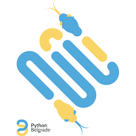

# Python Meetup #18
Materials from the talk I gave at [Python Meetup #18](https://www.meetup.com/PythonBelgrade/events/250841069/)

Thank you all for attending and being an amazing audience!

## Required to run
- Python 2.7 (numpy, matplotlib, keras, tensorflow or theano, flask)

## DeepDream
- Code was taken from official Keras example for DeepDream

## Serbian Epic Poems
- Idea was originally inspired by [vivshaw/shakespeare-LSTM](https://github.com/vivshaw/shakespeare-LSTM)

